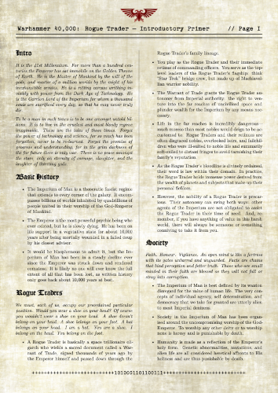
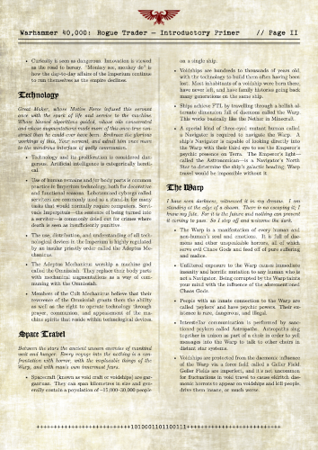

# Rogue Trader // Setting One-Pager Handout // Warhammer 40k
[![CC BY-SA 4.0][cc-by-sa-shield]][cc-by-sa]

This handout an introductory primer for the setting of [Rogue Trader](https://wh40k.lexicanum.com/wiki/Rogue_Trader_Core_Rulebook), a tabletop roleplaying game by Fantasy Flight Games set in the [Warhammer 40,000](https://en.wikipedia.org/wiki/Warhammer_40,000) sci-fi universe. Please feel free to print off and use this with new players at your table. Or, you can fork this repo, compile it yourself, and make your own fluffy in-universe-style documents to do as you please with.

**Disclaimer:** Warhammer 40,000 is a trademark and product of [Games Workshop](https://www.warhammer.com/en-CA/home). This repo is an unlicensed fan work and is not associated with or endorsed by Games Workshop. Please don't sue me.

<p align="center">
  
  
</p>

I created this handout because I wanted to run a Rogue Trader game for a new group with little to no familiarity to the Warhammer 40k universe. 

Given how vast, complicated, and hard to get into this setting is, my goal was convey the absolute bare minimum "shit you need to know" in an economical single-page handout for new players. Be aware that I've generalised, glossed over, and dumbed down a lot of details to ensure that all the text fits onto two sides of a single sheet of paper. Consider this a conversation starter for your players! 😉

Nobody likes being given a boring wall of text, so I've spruced up the layout with eye candy to make the handout feel more immersive so that our players are more likely to actually read it.

## Quote References

None of the italics flavour quotes are attributable to me. Here is where they all are from if you want to check out the source material:

- "*It is the 41st Millennium [...] thirsting gods*" - R. Priestley, *Warhammer 40,000 Rogue Trader*. Nottingham: Games Workshop, 1987. ISBN 1-869893-23-9. Page 1.
- "*We must, each of us, occupy our preordained particular [...] You belong on the foot.*" - *Snowpiercer*, directed by Bong Joon-ho, IMDB tt1706620, 2013.
- "*Faith. Honour. Vigilance.*" - A. Chambers, *Codex: Dark Angels (3rd Edition)*. Nottingham: Games Workshop, 2003. ISBN 1-84154-302-0. Page 24.
- "*An open mind is like a fortress with its gates unbarred and unguarded.*" - Relic Entertainment, *Warhammer 40,000: Dawn of War* [Video Game], THQ, Sep. 2004.
- "*Facts are chains that bind perception and fetter truth.*" - R. Priestly, A. Chambers, G. Thorpe, I. Pickstock, and J. Johnson, *Warhammer 40,000 (3rd Edition)*. Nottingham: Games Workshop, 2000. ISBN 1-869893-19-0. Page 70.
- "*Those who are small minded [...] stray into corruption.*" - /u/hidden_emperor, “Re: Meaning of a 40k quote,” Reddit, r/40kLore, Aug. 25, 2021. [Online]. Available: https://old.reddit.com/r/40kLore/comments/pb00cr/meaning_of_a_40k_quote/ha8d2yx/. [Accessed: Jul. 21, 2025].
- "*Great Maker, whose Motive Force [..] godly communion.*" - R. Sanders, *Adeptus Mechanicus: Tech-Priest*. Nottingham: Black Library, 2015. ISBN 978-1782518051.
- "*Between the stars the ancient unseen enemies of mankind wait and hunger.*" - R. Priestly, A. Chambers. *Warhammer 40,000 Codex Imperialis (2nd Edition)*. Nottingham: Games Workshop, 1993. ISBN 978-1869893835. Page 7.
- "*I have seen darkness [...] So I step off and welcome the dark.*" - N. Kyme, *Vulkan Lives*. Nottingham: Black Library, 2013. ISBN 9781849705127.

## Assets Used

- [Warhammer 40,000 Imperial Aquila SVG by mack648](https://seeklogo.com/vector-logo/342858/imperial-aquila).
    - I am pretty sure that the Imperial Aquila is a trademark of Games Workshop. I have made use of it with no license, endorsement, or permission for this fan creation.
- Fonts:
    - [KJV1611](https://github.com/ctrlcctrlv/kjv1611) by Fredrick Brennan [@ctrlcctrlv](https://github.com/ctrlcctrlv) (OFL-1.1 license - License text in asset folder)
    - [TT2020](https://github.com/ctrlcctrlv/TT2020) by Fredrick Brennan [@ctrlcctrlv](https://github.com/ctrlcctrlv) (OFL-1.1 license - License text in asset folder)

## GitHub Actions Workflow

This document is compiled with GitHub Actions in XeLaTeX using [xu-cheng/latex-action](https://github.com/xu-cheng/latex-action). You can build the document yourself if you fork this repo and manually trigger the **Compile and Upload** action from the Actions tab.

## Full-Bleed Printing

In order to do a full bleed duplex print, we need to print the handout centred on B4 so that we can trim it down to B4. We can do this with `pdfjam`.

I'm gonna be honest: the tex devops ecosystem is a nightmare and Ubuntu's repos (which GH Actions native runners run on) are an even bigger nightmare, so I have not even bothered to try and make a centred fullbleed print layout autmated in CI. Instead, I have just been manually throwing together a print copy of this on my local system in a throwaway nix shell because that's easier.

Anyway here's how I do that:

Install `pdfjam`, poppler, and ghostscript into a Nix shell (tested on NixOS 25.05):

```bash
nix-shell -p texlive.combined.scheme-full poppler_utils ghostscript
```

Then we need to centre it on B4 so that if we print it in duplex both sides will line up:

```bash
pdfjam handout-a4.pdf \
  --papersize '{250mm,353mm}' \
  --noautoscale true \
  --scale 1 \
  --offset '0cm 0cm' \
  --outfile handout_fullbleed_b4.pdf
```

Alternatively, for US paper sizes:

```bash
pdfjam handout-a4.pdf \
  --papersize '{11in,17in}' \
  --noautoscale true \
  --scale 1 \
  --offset '0cm 0cm' \
  --outfile handout_fullbleed_us-tabloid.pdf
```

Remember to print with flip on long edge when printing in duplex so that the back side isn't upside down.

## License

This work and source code is licensed under a
[Creative Commons Attribution-ShareAlike 4.0 International License][cc-by-sa].

[![CC BY-SA 4.0][cc-by-sa-image]][cc-by-sa]

[cc-by-sa]: http://creativecommons.org/licenses/by-sa/4.0/
[cc-by-sa-image]: https://licensebuttons.net/l/by-sa/4.0/88x31.png
[cc-by-sa-shield]: https://img.shields.io/badge/License-CC%20BY--SA%204.0-lightgrey.svg
